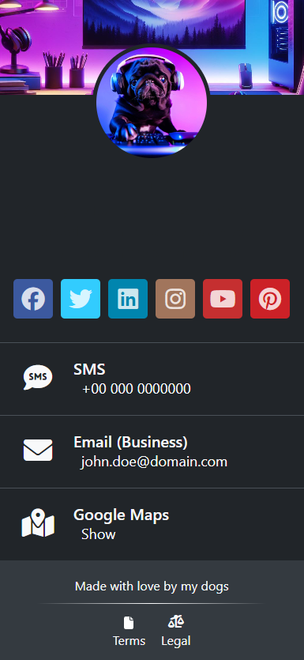

# My Digital Card

My Digital Card is a modern, React-based application designed to create a personalized and interactive digital business
card. This project makes it simple for professionals to share their contact information, social media profiles, and
personal branding in a digital format that is accessible anywhere.

### Live Preview
[https://weisser-dev.github.io/my-digital-card/](https://weisser-dev.github.io/my-digital-card/)


## Table of Contents

- [Features](#features)
- [Installation](#installation)
- [Usage](#usage)
- [Configuration](#configuration)
- [Folder Structure](#folder-structure)
- [Using Font Awesome Icons](#using-font-awesome-icons)
- [Contributing](#contributing)
- [License](#license)
- [Forking and Deployment](#forking-and-deployment)
- [Screenshots](#screenshots)

## Features

- **Profile Image**: Display a headshot or logo to represent yourself or your brand.
- **Background Image**: Set a backdrop that captures your professional persona.
- **Social Media Profiles**: Link out to your professional social media pages with ease.
- **Customizable Elements**: Add custom card elements tailored to your business needs.
- **Theme Support**: Switch between light and dark mode or apply a custom theme to match your style.
- **Simple Configuration**: Update your digital card using a straightforward `config.json` file.
- **Data Privacy**: Encode your personal data to keep it secure when your card is shared publicly.

## Installation

To get started with My Digital Card:

1. Ensure you have [Git](https://git-scm.com/downloads) and [Node.js](https://nodejs.org/en/download/) installed.
2. Clone the repository:
   ```bash git clone https://github.com/weisser-dev/my-digital-card.git```

3. Navigate to the project directory:     `cd my-digital-card`

4. Install the necessary dependencies:    `npm install`

## Usage

Begin by starting the development server to see your card in action: `npm start`

This launches the card at `http://localhost:3000`. Before you do this, create a `profileData.json` based on the
provided `template.json` to ensure all your information is displayed correctly.

## Configuration

The `config.json` file controls various aspects of your digital card:

- **Themes**: Choose 'auto' for system preference, 'light' or 'dark' for fixed themes, or 'default' for a custom theme.
- **SEO**: Enable or disable search engine indexing based on your visibility preferences.
- **Encoding**: Opt to encode your profile data for an extra layer of privacy.

Refer to the `config.json` file and update the settings as needed for your use case.

## Folder Structure

Each part of the application is neatly contained within specific folders:

- `src/`: The heart of the React application.
    - `components/`: Reusable UI pieces.
    - `data/`: Home for `profileData.json`.
    - `config/`: Where `config.json`  file live.
    - `colorThemes/`: Different stylesheet options for theming.
- `public/`: Houses static files like images and the main HTML file.
- `build/`: The output directory for production-ready builds.

## Using Font Awesome Icons

Font Awesome icons enhance the visual appeal of your card. Here's how to use them:

1. Find the icon on [Font Awesome](https://fontawesome.com/icons).
2. Copy the class name (e.g., `fa-github`).
3. Insert it into `profileData.json` for the appropriate element.

## Contributing

I encourage contributions! To contribute:

1. Fork the repo.
2. Create a feature branch: `git checkout -b new-feature`
3. Commit changes: `git commit -am 'Add some feature'`
4. Push to the branch: `git push origin new-feature`
5. Submit a pull request.

## License

My Digital Card is under the MIT License.

## Forking and Deployment

Feel free to fork this project and make it your own. Here's how to deploy your version:

1. Fill out `profileData.json` with your details.
2. Customize images to avoid using the default ones, such as my dog's photo.
3. Prepare your data for deployment with `npm run prebuild`.
4. Commit the base64 encoded data file.
5. Deploy to your preferred service, like GitHub Pages (Works out of the box).

Happy sharing of your professional digital business card!

## Screenshots

### Mobile View


### Desktop View


### Themes



